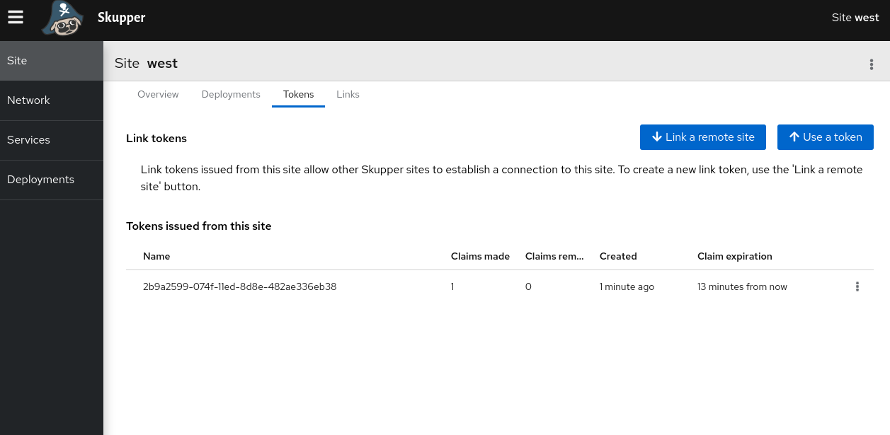

- If I delete a token, does it revoke access?
	- no, it prevents the token from being used again.
	- 
- Is it possible to configure `skupper init` to pull the images from an internal registry?
	- Yes, you can configure custom registry by defining these environment variables before running skupper init .
	  ```
	  export SKUPPER_SERVICE_CONTROLLER_IMAGE=
	  export SKUPPER_CONFIG_SYNC_IMAGE=
	  export QDROUTERD_IMAGE=
	  ```