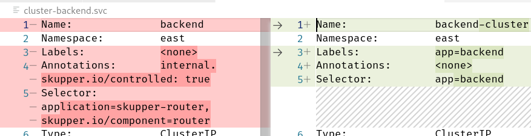

- How does a skupper service compare with a 'native' kubernetes service from a kubernetes pov?
	- Looking at [skupperproject/skupper-example-hello-world: A minimal multi-service HTTP application deployed across sites using Skupper CLI](https://github.com/skupperproject/skupper-example-hello-world) and setting context to `east`, you can expose the backend deployment using native kubernetes:
	  ```
	  kubectl expose deployment backend --port 8080 --name=backend-cluster
	  ```
	- Now can compare the skupper service and the kubernetes service
	  
	- You can see how the skupper service is annotated and how the selector is more complex, involving the skupper router and thus providing the cross cluster connectivity under the hood.