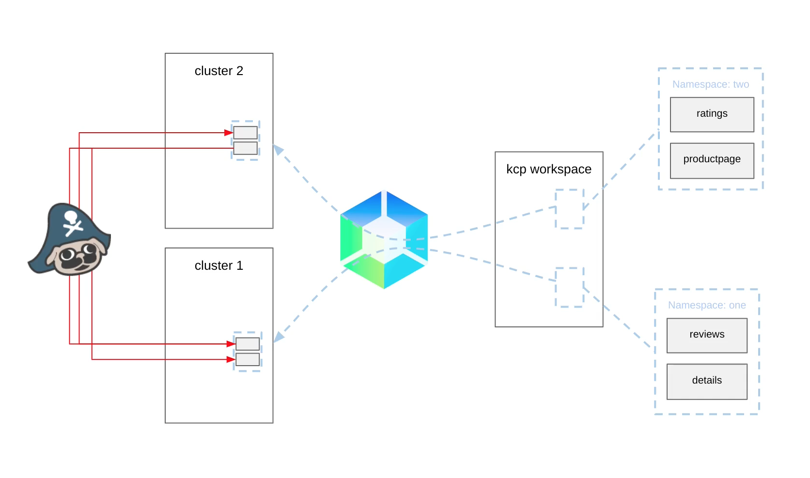
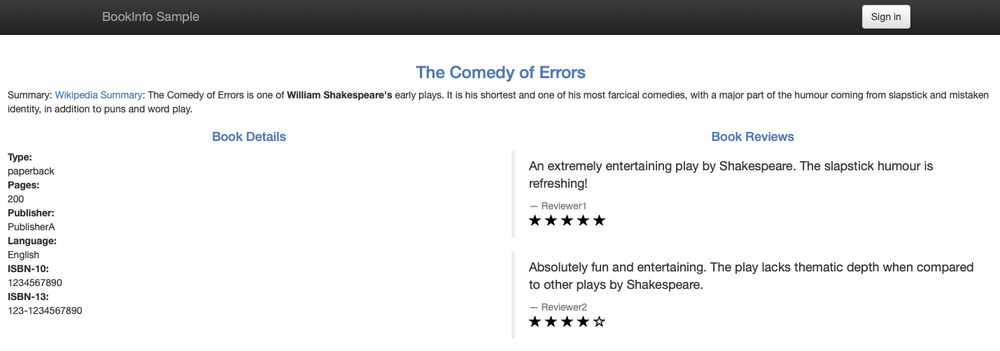

- [Gordon demo](https://github.com/grs/skupper-kcp-demo) - [video](https://github.com/grs/skupper-kcp-demo/blob/main/skupper-kcp-demo.mp4?raw=true)
	- In this [demo](https://github.com/grs/skupper-kcp-demo/blob/main/skupper-kcp-demo.mp4?raw=true), I want to show how [KCP](https://github.com/kcp-dev) and [Skupper](https://skupper.io/) combined to make deploying multi cloud application simpler.
	-  
	  ([Watch video](https://github.com/grs/skupper-kcp-demo/blob/main/skupper-kcp-demo.mp4?raw=true))
	- I'm going to use the familiar Bookinfo for application for the demo. This has a product page service that serves the page shown here.
	- 
	- The product page service calls the detail service to get the information displayed on the left panel. It calls the review service to get the reviews that are displayed on the right. The review service itself calls the rating service to get the ratings. In a real multi cloud application, the location of the components may be driven by different regulatory requirements. Different elasticity requirements by dependencies and other services are numerous other reasons. For our demo, we're going to arbitrarily divide this book info application into two with two services deployed to one cluster and the other two services to another cluster.
	- We've used [KCP](https://github.com/kcp-dev) to simplify the actual deployment. Using our KCP workspace in the familiar Kubernetes. CLI will apply the Yam defining the resources for the two halves of our application to two different namespaces. KCP will then based on rules we define, deploy those resources to actual Kubernetes clusters namespace one will go to cluster one. Namespace two will go to cluster two. Skupper will then be used to automatically configure a virtual mutually TLS secured Application Scope network allowing the services to communicate seamlessly between the two clusters. The first stage is to get our KCP workspace created and synced to two physical clusters. In this demo, I'm running KCP on my laptop and have two kinds of clusters, at least one of which has to have support for load balancer type services. First thing I'm going to do is to install the Skupper CRDs and site controller on to these two kinds of clusters. Then, I'll create a new KCP workspace using the cube context for my KCP server.
	- Now we can start syncers for this workspace to the two kinds of clusters. As well as the default set of resources we want to sync some Skupper resources as well.
	  
	  The two clusters are represented in our workspace by to sync target resources. You want to define two locations with one of the clusters mapped to each.
	   Then we create placement rules to define which namespaces get mapped which locations will also delete the default location and placement to ensure the ones we defined are used. Now we can deploy the scupper network controller to the KCP workspace with that our case would be workspaces or set up and we're ready to deploy the application.
	- First we create two namespaces one and two, each labelled to match the appropriate placement rule for our two locations.
	- Now we deploy one half of bookinfo to namespace one. And the other half to namespace two we can query cluster one to get the IP of our product page service.
	- As the reviews in detailed service, or on the other cluster, we currently get errors in the bottom panels of the page. To fix that we need to tell Skupper about the dependencies between services and namespace one. We create a required service resource for reviews and details. provided service resource for ratings. In namespace two, we define a required resource named ratings and provided service resources for reviews and details.
	- With those dependencies defined Skupper will create the required Kubernetes services and configure the necessary connectivity can then try our product page again, we now see that it works as desired. So using KCP and Skupper we can make it easy to deploy your distributed application through a single control plane and allow it to communicate without any changes to the code or configuration. Get the script for this demo at the following URL:
	- [https://github.com/grs/skupper-kcp-demo](https://github.com/grs/skupper-kcp-demo)