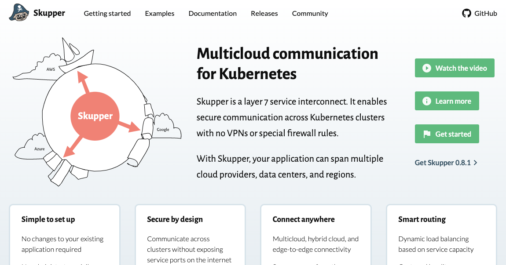

-
- [Skupper](https://skupper.io/) is software that allows you run services locally or in a Kubernetes cluster, and those services can appear to run natively in a different Kubernetes cluster.
  
- [[What Skupper is not]]
- [[What is the router]]