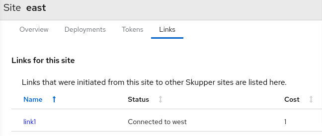
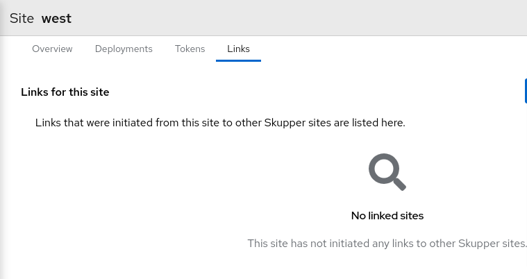

- Typically, you link sites by:
	- `skupper token create` on a skupper site that has ingress (ie is accessible from other sites)
	- `skupper link create` using that token from the 'other' site
- What does that look like in the Gilligan console?
	- 
	- 
	-
- {{embed [[skupper_token_create]]}}
- {{embed [[skupper_link_create]]}}